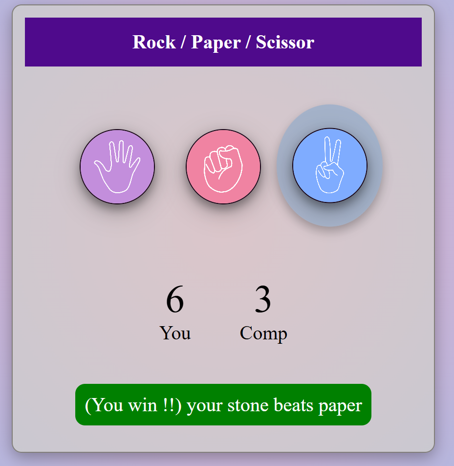

# 🎮 Rock Paper Scissors Game

A simple **Rock Paper Scissors** game built with **HTML, CSS, and JavaScript**.  
Play against the computer and test your luck!  

---

## 📸 Screenshots

### Game UI

---

## 🚀 Features
- Classic **Rock, Paper, Scissors** rules
- Interactive **hover & click effects**
- Real-time **winner messages**
- Keeps track of **user and computer choices**
- Responsive design

---

## 🛠️ Technologies Used
- **HTML5**
- **CSS3** (with hover and click animations)
- **JavaScript (ES6)**

---

## ▶️ How to Play
1. Choose **Rock**, **Paper**, or **Scissors** by clicking on the icon.
2. The computer randomly selects its choice.
3. The winner is displayed instantly.
4. Try beating the computer!

---

Made with ❤️ by Pratik Bokade.
